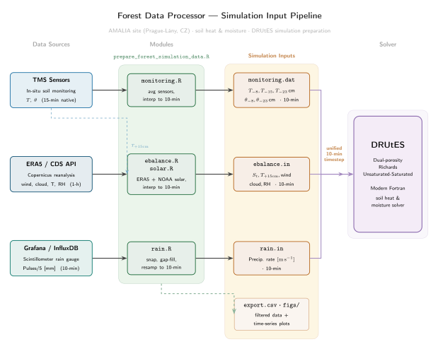

# Forest Data Processor

Scripts for preparing simulation inputs for the **DRUtES** forest soil model from monitoring and external weather data collected at the **AMALIA** research site (Bohemian Forest, Czech Republic).


## What it does

`prepare_forest_simulation_data.R` is an interactive CLI wizard. You run it, answer a series of prompts, and it generates all files needed to drive a DRUtES simulation for a chosen tree species, sensor location, and date range.

| Output file | Contents |
|---|---|
| `<tree>_<loc>_export.csv` | Filtered TMS sensor data |
| `<tree>_<loc>_monitoring.dat` | Soil temperature + moisture forcing, 10-min timestep |
| `<tree>_<loc>_ebalance.in` | Energy balance: solar radiation + ERA5 met variables, 10-min |
| `<tree>_<loc>_rain.in` | Precipitation rate [m/s] from scintillometer, 10-min |
| `figs/*.png` | Time-series plots of all variables |

All outputs are written to `out/Campaign_<D-M-YYYY>_<D-M-YYYY>/`.

---

## Project structure

```
Forest_Data_Processor/
├── prepare_forest_simulation_data.R   ← main interactive script
├── modules/
│   ├── utils.R         ← shared helpers, variable catalogue, interactive input
│   ├── solar.R         ← NOAA solar radiation algorithm, GPS/bbox parser
│   ├── monitoring.R    ← write_monitoring_dat()
│   ├── ebalance.R      ← ERA5 download + write_ebalance_in()
│   └── rain.R          ← Grafana/InfluxDB download + write_rain_in()
├── data/
│   ├── TMS_standard_long.rds     ← TMS sensor dataset (not in repo, ask supervisor)
│   └── amalie_gps_cords.txt      ← site coordinates and ERA5 bounding box
├── out/                           ← generated campaign outputs (not in repo)
├── install_dependencies.R         ← run once to install all R packages
└── README.md
```

---

## Requirements

### System packages

Install the NetCDF library before installing the `ncdf4` R package:

| OS | Command |
|---|---|
| Arch Linux | `sudo pacman -S netcdf` |
| Ubuntu / Debian | `sudo apt install libnetcdf-dev libhdf5-dev` |
| Fedora / RHEL | `sudo dnf install netcdf-devel hdf5-devel` |
| macOS (Homebrew) | `brew install netcdf` |

### R version

R ≥ 4.2 is required.

### R packages

Run once after cloning:

```bash
Rscript install_dependencies.R
```

This installs: `data.table`, `ggplot2`, `httr`, `jsonlite`, `ncdf4` into `~/R/libs`.

---

## Credentials setup

Two external services require credential files in your home directory. Both files should be readable only by you (`chmod 600`).

### ERA5 — Copernicus Climate Data Store

Used for: wind speed, cloud cover, relative humidity (ebalance.in).

1. Register at <https://cds.climate.copernicus.eu>
2. Accept the ERA5 dataset licence on the dataset page
3. Copy your personal access token from your profile
4. Create `~/.cdsapirc`:

```
url: https://cds.climate.copernicus.eu/api
key: <your-personal-token>
```

```bash
chmod 600 ~/.cdsapirc
```

### Grafana / InfluxDB — Rain gauge

Used for: scintillometer precipitation data (rain.in).

Create `~/.grafanarc`:

```
url: https://data.bluebeatle.cz
user: <username>
password: <password>
datasource_id: 1
database: miotiq_hub_develop
```

```bash
chmod 600 ~/.grafanarc
```

---

## Usage

Run from the `Forest_Data_Processor/` directory:

```bash
Rscript prepare_forest_simulation_data.R
```

The script prompts for:

| Prompt | Options |
|---|---|
| Date range | DD.MM.YYYY |
| Tree species | `smrk` (spruce), `buk` (beech), `modrin` (larch) |
| Location | 1, 2, or 3 |
| Soil layer | `topsoil`, `subsoil`, or `all` |
| Sensors | `avg` to average all, or specific numbers from the list |
| Variables | `T1`, `T2`, `T3`, `moisture`, `Wmm` — or `all` |
| Output files | y/n for each: CSV, monitoring.dat, plots, ebalance.in, rain.in |

ERA5 data is cached as `era5_data.nc` in the campaign directory — re-running the script for the same period will skip the download.

---

## Output file formats

### monitoring.dat

Space-separated, 10-min timestep, simulation time in seconds from campaign start.

```
# campaign: 2024-09-08 00:00:00+00:00 2024-09-30 00:00:00+00:00
# time[s] T_n8cm[°C] T_n15cm[°C] T_n23cm[°C] theta_n8cm[-] theta_n23cm[-]
0 15.3 14.1 13.8 0.32 0.41
600 15.2 14.0 13.7 0.32 0.41
...
```

Depth mapping: topsoil T1 → −8 cm, subsoil T2 → −15 cm, subsoil T1 → −23 cm.

### ebalance.in

Tab-separated, 10-min timestep.

```
#campaign 2024-09-08 00:00 2024-09-30 00:00
#time[s]  S_t[W/m2]  T_15cm[°C]  wind_speed[m/s]  total_cloud_cover[-]  relative_humidity[%/100]
0  0.0  14.5  1.2  0.6  0.78
...
```

### rain.in

Tab-separated, 10-min timestep, rain rate in m/s.

```
##EVENT 2024-09-08 00:00 - 2024-09-30 00:00
#time  rain[m/s](scintilometr)
0  0
600  1.11e-06
...
```

Conversion: 1 mm / 10 min = 1.667 × 10⁻⁶ m/s.

---

## Sensor variables

| Column | Depth | Unit |
|---|---|---|
| T1 | −80 mm (air/litter) | °C |
| T2 | 0 mm (surface) | °C |
| T3 | +150 mm (soil) | °C |
| moisture | volumetric water content | m³/m³ |
| Wmm | water equivalent depth | mm |

Note: T1/T2/T3 refer to different physical depths in topsoil and subsoil sensors — they are always averaged separately and never pooled across horizons.
